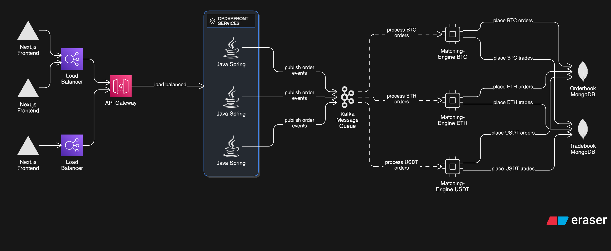
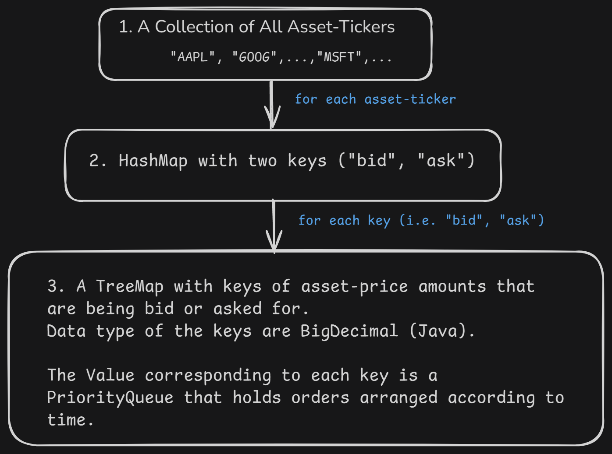

# An Order-Book and Matching Engine Microservices System with a Next.js Front-end

## Introduction
This is a microservices based project that collects orders into an orderbook and then performs order matching.

There is  a Next.js frontend that allows the end-user to send orders to the system. 
The system performs order collection and matching and then informs the user of order completion. 

## Tech Stack at a glance
The frontend is a Next.js 15 app. 
The Microservices are Java Spring Boot apps. 
There are two Microservices:
1. Order-Book : _collect orders from the frontend and pass to the rest of the system_
2. Matching-Engine : _performs the matched between the bid and ask orders and updates transactions into order-book mongodb and trade-book mongodb instances._

Kafka is used for async messaging within the Microservices system. Protobuf messages are used for messaging with Kafka.

## Architectural Diagram
System Diagram:

## Scaling Strategy
1. The API Gateway supported with load-balancing forms the first layer of scaling wherein differing number of Orderbook Services will be provisioned as per the incoming API request traffic. 
2. These services place checked/correctly formatted orders into a Kafka queue. As traffic increases, additional brokers can be provisioned to handle the increase in loads. 
3. The primary way of distributing messages between brokers, and later into the matching-engine service instances, will be the asset-ticker symbols (which are strings holding the asset-ticker e.g. AAPL, MSFT, GOOG etc). Scaling is meant to be accomplished by diving these asset-ticker strings by alphabetical ordering and segmenting among the various kafka brokers/partitions and thus eventually into corresponding matching-engine service instances based on the partitions they have kafka consumers ingesting data from.
4. Each matching-engine service has its own mongodb instance thus the DB gets scaled alongwith the matching-engine service instances.

## Data Structure Designs in Matching-Engine Service

The Matching Engine service is tasked with matching bids with asks in a manner that gathers the highest spread possible while making matches. 

1. The root-data structure holds the ticker-symbols of the assets as keys which will hold other data-structures that bottom down to individual order-records that are to be matched. _This is a Hashmap with Asset-ticker: String as keys._
2. For each asset-ticker there's a HashMap holding two keys exactly: "bid", "ask". Each holding either the Bid or Ask orders arranged in to cascading data-structures. 
3. Each of the keys (i.e., "bid", "ask") holds a TreeMap with Price (of the Bid of Ask orders) in BigDecimal datatype for efficient monetary calculations. Java TreeMaps, being implementations of Red-Black Trees, can perform retrieval, insertion and deletions in O(log n).
4. For each key (Price: BigDecimal) in the TreeMap the value is a PriorityQueue holding all orders (bid or ask as per the containing data-structures) arranged as per the time in which the orders were made (received by the order-front service). PriorityQueues in Java Collections perform offer/add and polls in O(log n) time. _The PriorityQueue takes care of holding orders with the same price in order of time._
5. Thus, the data structures enable holding orders in accordance to the asset they are made against, whether the orders are Bids or Asks, then grouped accouring to the price-points of the orders, and finally for each price-point the orders are ordered by their timestamp of order-arrival. Thus Orders can be made in terms of price matching (for greatest spread) and then in accordance to time for orders with the same price-point.

## YouTube Quick Demo: 

