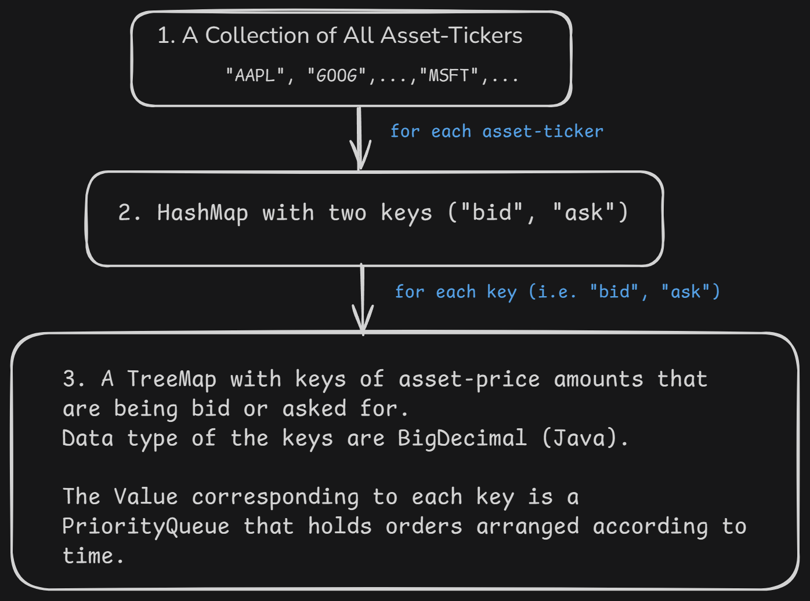
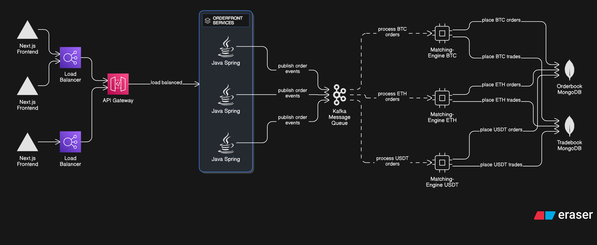
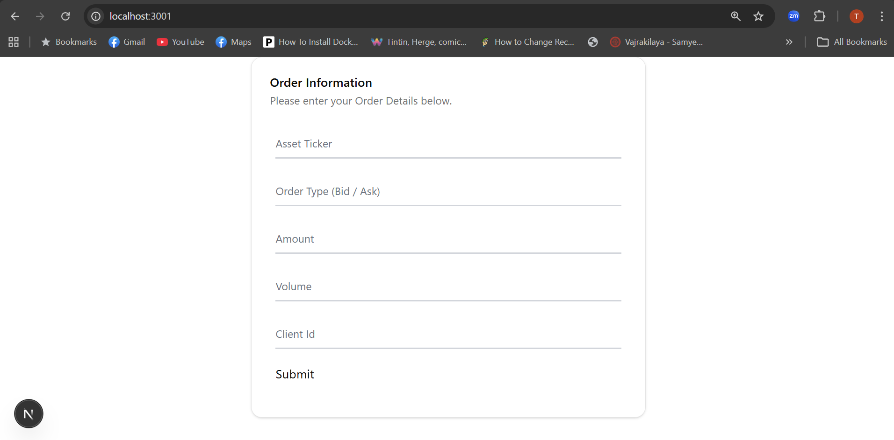
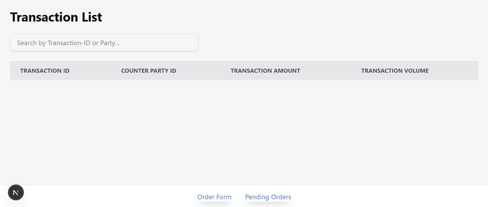
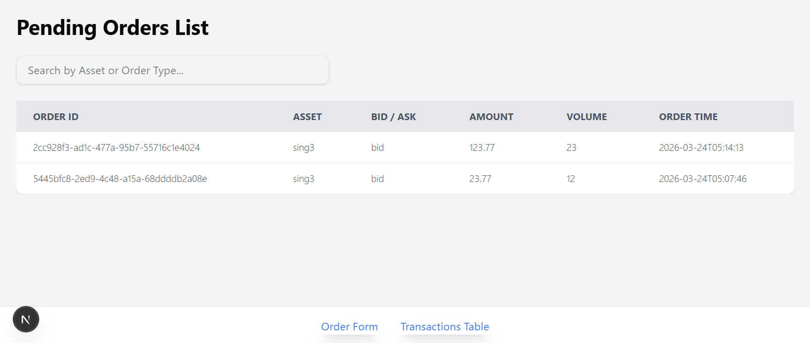

# An Order-Book and Matching Engine Microservices System with a Next.js Front-end

## Introduction
This is a microservices based project that collects orders into an orderbook and then performs order matching.

There is  a Next.js frontend that allows the end-user to send orders to the system. 
The system performs order collection and matching and then informs the user of order completion. 

## What it does
- Accepts orders (bid/ask) from a Next.js frontend via a REST API gateway
- Serialises orders as Protobuf messages onto a Kafka topic for async, durable ingestion
- Matches incoming orders against the live order book using **price-time priority**: best price first, then earliest order at that price
- Handles partial fills, full fills, and residual volume re-queuing correctly
- Prevents self-matching (same client cannot fill their own opposite-side order)
- Persists paired transaction records (one per party) to MongoDB on every fill
- Exposes real-time performance metrics via Micrometer / Prometheus

### Services

| Service | Responsibility |
|---|---|
| **API Gateway** | Load-balanced entry point; routes frontend requests, handles auth |
| **Order-Book Service** | Validates and serialises incoming orders onto the Kafka topic |
| **Matching-Engine Service** | Consumes from Kafka; runs the matching algorithm; writes transactions to MongoDB |

### Messaging
Orders are published as **Protobuf-serialised** messages on a Kafka topic, partitioned by asset ticker symbol. This means all orders for `AAPL` always route to the same Matching-Engine instance — guaranteeing order book consistency per asset without distributed locking.

## Order Book Data Structure



The in-memory order book is a three-level nested structure:

```
rootAssetHashMap                          HashMap<String, ...>
  └── asset ticker (e.g. "AAPL")
        ├── "bid"  →  TreeMap<BigDecimal, PriorityQueue<Order>>   (descending price)
        └── "ask"  →  TreeMap<BigDecimal, PriorityQueue<Order>>   (ascending price)
```

| Level | Structure | Ordering | Complexity |
|---|---|---|---|
| Asset | `ConcurrentHashMap` | unordered | O(1) lookup, thread-safe |
| Price | `TreeMap` (Red-Black Tree) | bid: highest first / ask: lowest first | O(log n) |
| Time | `PriorityQueue` | earliest order first | O(log n) |

`BigDecimal` is used for all price values to guarantee exact decimal arithmetic — no floating-point rounding errors in financial calculations.

`MongoDB` is used as the 'Cold Path' for audit-logging and transaction history, ensuring that matching logic (the 'Hot Path') remains entirely in-memory for microsecond latency

`Resilience4j` used to place a circuit breaker on gateway → matching-engine route
## Engineering Design

### Refactored matching logic — Strategy pattern

The core matching algorithm is decomposed using the **Strategy pattern**:

```
MatchingStrategy (interface)
  ├── AskMatchingStrategy   — walks bid tree (highest → lowest), stops when bid < ask price
  └── BidMatchingStrategy   — walks ask tree (lowest → highest), stops when ask > bid price
```

Each strategy returns a `List<MatchResult>` — an immutable value object capturing fill volume, spread, and fill type (`EXACT`, `INCOMING_PARTIAL`, `COUNTERPARTY_PARTIAL`). The `OrderBook` orchestrator calls the strategy, persists results, and re-queues residual volume. No matching logic lives in the orchestrator.

Additional patterns applied:
- **Builder** on `TransactionItemModel` — eliminates 6× copy-pasted transaction construction blocks, enforces required fields at compile time
- **Factory Method** (`AssetOrderBookFactory`) — centralises comparator selection and TreeMap initialisation, keeps `OrderBook` free of construction logic

### Test coverage — 31 tests across 4 files

| Test class | Scope | Framework |
|---|---|---|
| `AskMatchingStrategyTest` | Pure unit — no Spring context | JUnit 5 + AssertJ |
| `BidMatchingStrategyTest` | Pure unit — no Spring context | JUnit 5 + AssertJ |
| `TransactionPersistenceServiceTest` | Unit with mocked repository | Mockito + ArgumentCaptor |
| `OrderBookIntegrationTest` | Full pipeline, mocked MongoDB only | JUnit 5 + Mockito |
| `OrderBookConcurrencyTest` | Multi-threaded stress, mocked MongoDB | JUnit 5 + `@RepeatedTest` |

Scenarios covered: exact fills, partial fills (both directions), multi-level draining, price boundary enforcement, self-match prevention, persistence failure resilience, volume conservation under concurrency, cross-asset independence, and atomic asset book initialisation.

### Observability — Micrometer + Prometheus 

Every order processed emits structured metrics:

| Metric | Type | Tags |
|---|---|---|
| `orderbook.orders.received` | Counter | `side` (ask/bid) |
| `orderbook.match.duration` | Timer (p50/p95/p99) | `side` |
| `orderbook.fills.total` | Counter | `side`, `fill_type` |
| `orderbook.fill.volume.total` | Distribution summary | `side` |
| `orderbook.persist.duration` | Timer (p50/p95/p99) | `side` |
| `orderbook.persist.failures` | Counter | `side` |

Metrics are pre-registered at startup so dashboards show zero-baselines before the first order arrives. Exposed at `/actuator/prometheus` for Grafana scraping.

---
### Resilience — Circuit Breaker

The API Gateway wraps calls to the Matching-Engine service with a
Resilience4j circuit breaker:

| Parameter | Value | Rationale |
|---|---|---|
| `slidingWindowSize` | 10 | Rolling window of last 10 calls |
| `minimumNumberOfCalls` | 5 | Avoids tripping on startup noise |
| `failureRateThreshold` | 50% | Opens after 5/10 failures |
| `waitDurationInOpenState` | 10s | Backoff before re-attempting |
| `permittedNumberOfCallsInHalfOpenState` | 3 | Probes recovery cautiously |

Should the circuit get open, the gateway returns a fast-fail response rather
than allowing threads to pile up waiting on a degraded downstream service.
Orders submitted during an open circuit are rejected with a 503 — Kafka
durability means no orders are lost; clients can retry once the circuit
recovers.
---

## Concurrency Design

### Thread safety model

The matching engine is designed to be safe under concurrent Kafka consumer threads while keeping contention as narrow as possible.

**`ConcurrentHashMap` for the asset registry**

The root map of asset tickers to order books uses `ConcurrentHashMap` with `computeIfAbsent()` for initialisation. This makes first-time asset book creation fully atomic — twenty threads arriving simultaneously for a new ticker (`NEWCOIN`) produce exactly one order book, with no explicit locking required.

**Per-asset `ReentrantReadWriteLock`**

Each asset's order book (`AssetOrderBook`) owns its own `ReadWriteLock`. The matching algorithm holds the write lock for the duration of a single order's lifecycle — tree traversal, fills, and residual requeue. Read operations (e.g. querying pending orders by client) hold the read lock, allowing multiple concurrent readers while no match is active.

This means:
- Threads matching `AAPL` orders never block threads matching `MSFT` orders
- Only threads competing for the **same asset ticker** ever contend
- Lock scope is as narrow as possible — acquired immediately before matching, released immediately after requeue

**Lock contract in `enterOrderItem_`**

```java
AssetOrderBook book = assetBooks.computeIfAbsent(asset, k -> factory.createAssetBook());
book.acquireWriteLock();
try {
    processOrder(order, book, orderType);   // match → persist → requeue
} finally {
    book.releaseWriteLock();                // always released, even on exception
}
```

The `finally` block is non-negotiable — an unreleased lock would freeze that asset's order book permanently.

**Concurrency test coverage**

`OrderBookConcurrencyTest` runs five scenario types, each with `@RepeatedTest(5)` to surface intermittent race conditions that single-run tests would miss:

| Test | What it verifies |
|---|---|
| 100 concurrent orders, same asset | No exceptions, no deadlock within 10s timeout |
| Volume conservation | filled + residual == submitted across 50 concurrent orders |
| Cross-asset independence | 4 assets × 20 threads — no cross-asset blocking |
| Atomic asset initialisation | 20 threads on new ticker → exactly one book created |
| Self-match under concurrency | Self-match prevention holds across concurrent bid/ask pairs |

---

## Future Architecture

### Scaling beyond the current model

The current per-asset `ReentrantReadWriteLock` handles concurrent load well up to moderate order rates. The progression toward higher throughput involves two steps, each with a clear trigger for when to apply it.

**Step 1 — Single Writer pattern** (when lock contention becomes measurable)

At high order rates on a single asset, multiple Kafka consumer threads begin spending meaningful time waiting to acquire the write lock. The Single Writer pattern eliminates this contention entirely: one dedicated thread per asset owns and mutates the order book, while Kafka consumer threads simply enqueue orders into a `LinkedBlockingQueue` and return immediately.

```
Kafka thread 1 ──┐
Kafka thread 2 ──┤──▶  BlockingQueue  ──▶  AssetMatchingWorker thread  ──▶  order book
Kafka thread N ──┘         (per asset)              (single writer)
```

Because only one thread ever touches the `TreeMap` and `PriorityQueue` structures, all locks on those data structures can be removed. The writer thread never context-switches mid-match, keeping the order book data hot in L1/L2 cache.

Trigger: when JMH benchmarks or Micrometer's `orderbook.match.duration` p99 shows lock wait time exceeding match time.

**Step 2 — LMAX Disruptor** (when queue throughput becomes the bottleneck)

`LinkedBlockingQueue` uses a lock internally for its own thread safety. At extreme order rates (hundreds of thousands per second per asset), this becomes the next bottleneck. The [LMAX Disruptor](https://lmax-exchange.github.io/disruptor/) replaces the blocking queue with a lock-free ring buffer using memory barriers and CPU cache-line padding to eliminate false sharing.

This is the architecture that powers LMAX Exchange — a financial exchange processing millions of orders per second on commodity hardware in Java, without garbage collection pauses on the hot path.

```
Kafka threads  ──▶  Disruptor ring buffer  ──▶  Single writer thread  ──▶  order book
                     (lock-free, cache-line                (no locks
                      padded, pre-allocated)                anywhere)
```

Trigger: only when Step 1 is in place and the queue itself shows as the bottleneck under profiling. For the vast majority of production matching engine deployments, Step 1 is sufficient.

**Why neither step is implemented yet**

With Kafka partitioned by asset ticker, all orders for a given asset already arrive on a single partition consumed by a single thread — the system currently exhibits Single Writer behaviour for free at the Kafka level. The per-asset lock protects against scenarios where `concurrency > 1` is configured on the `@KafkaListener`, or where multiple partitions for the same asset are assigned to the same consumer instance. Implementing the full Single Writer pattern is the correct next step when profiling shows contention, not before.

---
## Consistency Patterns for Cross-Asset Dependencies (Spread & Basket Trading)
The current architecture utilizes asset-ticker partitioning to guarantee strict consistency for individual order books. However, for huge-scale institutional trading atomic multi-leg execution (e.g., Spread Trading, Index Baskets, or Statistical Arbitrage) maybe desired. In order to scale these dependencies without breaking the low-latency "Single Writer" model, the following strategies are proposed:
* **Deterministic Asset Colocation**: For high-frequency pairs (e.g., GOOG vs. GOOGL or SPY vs. ES), the Kafka partitioning logic is updated to route correlated tickers to the same partition and Matching-Engine instance. This allows the matching engine to perform atomic matches across both books within a single memory space and lock scope, maintaining $O(\log N)$ performance. This can be done using a custom Kafka Partitioner that hashes an "Asset Group ID" rather than a single ticker symbol.

* **Distributed Coordinator Pattern**: For complex spreads across disparate partitions, a dedicated Cross-Asset Coordinator service is introduced to manage the 'All-or-None' atomicity of the trade. The Coordinator sends a "Conditional Match" request to Leg A's engine to lock liquidity. Once confirmed, it executes Leg B - in case there's a failure then If Leg B fails to fill, the Coordinator sends a "Compensating Transaction" to release Leg A, preventing partial fills in a spread trade. This enhances the consistency of the system overall. 

* **Shared-Memory Communication/Coordination (Aeron/Chronicle)**: For the enhancement of this system to extreme (sub-microsecond) low-latencies at scale, the network-hop delays introduced by Kafka partitions can be replaced with a shared-memory messaging bus like Aeron as a streamlining measure. In this case, a single hardware-clocked sequencer would assign a global sequence number to all incoming orders across all assets. And, Matching engines would co-ordinate with this shared-memory bus, so that they can maintain synchronized views of correlated assets without the overhead of distributed locking.
---

## Tech Stack

| Layer | Technology |
|---|---|
| Frontend | Next.js 15, TypeScript |
| API Gateway | Spring Boot, Spring Cloud Gateway |
| Microservices | Java 17, Spring Boot 3 |
| Messaging | Apache Kafka, Protobuf |
| Persistence | MongoDB |
| Testing | JUnit 5, Mockito, AssertJ |
| Metrics | Micrometer, Prometheus |
| Infrastructure | Docker, Docker Compose |
| CI | GitHub Actions |

---
## Architectural Diagram
System Diagram:


## Scaling Strategy
1. The API Gateway supported with load-balancing forms the first layer of scaling wherein differing number of Orderbook Services will be provisioned as per the incoming API request traffic. 
2. These services place checked/correctly formatted orders into a Kafka queue. As traffic increases, additional brokers can be provisioned to handle the increase in loads. 
3. The primary way of distributing messages between brokers, and later into the matching-engine service instances, will be the asset-ticker symbols (which are strings holding the asset-ticker e.g. AAPL, MSFT, GOOG etc). Scaling is meant to be accomplished by diving these asset-ticker strings by alphabetical ordering and segmenting among the various kafka brokers/partitions and thus eventually into corresponding matching-engine service instances based on the partitions they have kafka consumers ingesting data from.
4. Each matching-engine service has its own mongodb instance thus the DB gets scaled alongwith the matching-engine service instances.

## Walk-through of Data Structure Designs in Matching-Engine Service

The Matching Engine service is tasked with matching bids with asks in a manner that gathers the highest spread possible while making matches. 

1. The root-data structure holds the ticker-symbols of the assets as keys which will hold other data-structures that bottom down to individual order-records that are to be matched. _This is a Hashmap with Asset-ticker: String as keys._
2. For each asset-ticker there's a HashMap holding two keys exactly: "bid", "ask". Each holding either the Bid or Ask orders arranged in to cascading data-structures. 
3. Each of the keys (i.e., "bid", "ask") holds a TreeMap with Price (of the Bid of Ask orders) in BigDecimal datatype for efficient monetary calculations. Java TreeMaps, being implementations of Red-Black Trees, can perform retrieval, insertion and deletions in O(log n).
4. For each key (Price: BigDecimal) in the TreeMap the value is a PriorityQueue holding all orders (bid or ask as per the containing data-structures) arranged as per the time in which the orders were made (received by the order-front service). PriorityQueues in Java Collections perform offer/add and polls in O(log n) time. _The PriorityQueue takes care of holding orders with the same price in order of time._
5. Thus, the data structures enable holding orders in accordance to the asset they are made against, whether the orders are Bids or Asks, then grouped accouring to the price-points of the orders, and finally for each price-point the orders are ordered by their timestamp of order-arrival. Thus Orders can be made in terms of price matching (for greatest spread) and then in accordance to time for orders with the same price-point.

## ⚡ Quick Start
Follow these steps to get the microservices up and running immediately after cloning.
1. Make sure your Docker service is up and running.
2. Clone the repo with:
   ```git clone https://github.com/tonmoy-b/Order-Book-Matching-Engine-Microservices.git```
3. Go to the cloned repo dir: ```cd .\Order-Book-Matching-Engine-Microservices\```
4. Either make a .env file based on the .env.example file or just duplicate it to run simply without the security features locally by:
   ```copy .env.example .env```
5. Start up the services in Docker: ```docker compose up -d```
6. Go to the frontend directory: ```cd frontend```
7. Install Next.js dependencies: ```npm install```
8. Start the Next.js app: ```npm run dev```
9. Open browser and go to ```localhost:3001```
10. At which point you will be in the below screen: 
11. After entering the orders you view the completed transactions as below: 
12. You can also view the pending Orders as below: 
    


## YouTube Quick Demo: 
[](https://www.youtube.com/watch?v=9uIVNLf1A-0)

## Repository Structure

```
├── order-book-service/          # Spring Boot — order ingestion and Kafka producer
├── matching-engine-service/     # Spring Boot — matching algorithm and transaction persistence
│   ├── service/matching/        # AskMatchingStrategy, BidMatchingStrategy, MatchResult
│   ├── service/persistence/     # TransactionPersistenceService
│   ├── service/metrics/         # OrderBookMetrics (Micrometer)
│   ├── service/                 # OrderBook, AssetOrderBook, AssetOrderBookFactory
│   └── model/                   # OrderItemModel, TransactionItemModel (Builder)
├── frontend/                    # Next.js 15 app
├── docker-compose.yml
└── .env.example
```